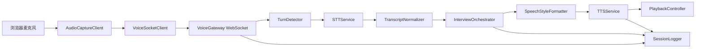

# AI 面试官语音功能总览

## 项目目标

本项目为 AI 面试官增加语音交互能力，让候选人可以通过语音回答问题，并让 AI 面试官以自然、专业、温和的声音继续提问、澄清和追问。

核心目标有两条：

- 候选人语音输入：浏览器采集语音，经 WebSocket 发送到后端，由 STT 服务转成稳定文本，再交给 LLM 理解。
- AI 面试官语音输出：LLM 生成回复文本，经清洗、断句、SSML 风格包装后，由 TTS 服务合成语音并流式播放。

## MVP 范围

- Web 端麦克风采集，推荐 `AudioWorklet` 输出 PCM16、16kHz、mono 音频。
- 后端提供 `/ws/voice/session` WebSocket 语音会话通道。
- 后端提供 `POST /api/interview-sessions` 创建面试会话。
- STT 默认抽象为 Azure Speech SDK，可扩展腾讯云、阿里云、FunASR。
- TTS 默认抽象为 Azure Neural TTS + SSML，可扩展 OpenAI TTS、CosyVoice。
- `stt.partial` 只用于前端字幕展示，`stt.final` 或稳定 utterance 才进入 LLM。
- 支持候选人说话时 barge-in 打断，停止前端播放并取消后端未完成的合成队列。
- 保存事件流日志、转写结果、LLM 输出、TTS 文本、延迟指标和错误信息。
- 提供 mock provider，方便无云账号时本地联调。

## 非目标范围

- 不在 MVP 中实现完整评分模型训练。
- 不在 MVP 中实现语音克隆或自定义真人音色训练。
- 不在 MVP 中实现完整 RTC 房间系统。
- 不在 MVP 中承诺离线私有化部署，但保留 FunASR、CosyVoice 等扩展位。
- 不使用 Edge TTS、ChatTTS、Bark 作为商用默认方案。

## 推荐技术栈

- 前端：Next.js、TypeScript、Web Audio API、WebSocket。
- 后端：FastAPI、asyncio、Pydantic。
- STT：Azure Speech SDK 作为 MVP 默认；腾讯云、阿里云、FunASR 作为可扩展 provider。
- TTS：Azure Neural TTS + SSML 作为 MVP 默认；OpenAI TTS、CosyVoice 作为可扩展 provider。
- 存储：PostgreSQL 存事件与结构化数据，S3/OSS/COS 存音频片段。
- 离线复核：faster-whisper 或 FunASR 对抽样音频二次转写。
- 观测：OpenTelemetry、Prometheus/Grafana，MVP 可先落结构化日志。

## 关键设计原则

- `stt.partial` 不进入 LLM，避免未稳定文本导致误追问。
- `stt.final` 或稳定 utterance 才进入 LLM。
- 所有 TTS 播放和合成任务必须可取消。
- TTS 文本必须先清洗、断句、规范数字和英文缩写，再包装 SSML。
- STT/TTS provider 必须通过接口抽象，业务编排不绑定单一厂商。
- 每个 turn 都记录 STT、LLM、TTS、端到端和打断延迟。
- 面试官语气默认专业、温和、清晰、不过度情绪化。
- 云服务、模型和声音授权必须在上线前完成合规确认。

## 端到端链路

## 目录说明

- `docs/`：产品、架构、接口、事件、提示词、TTS 风格、开发计划、合规和观测文档。
- `scaffold/frontend/`：前端 TypeScript 骨架，覆盖录音、WebSocket、播放和打断控制。
- `scaffold/backend/`：FastAPI 后端骨架，覆盖 REST、WebSocket、STT/TTS provider、编排和日志。

