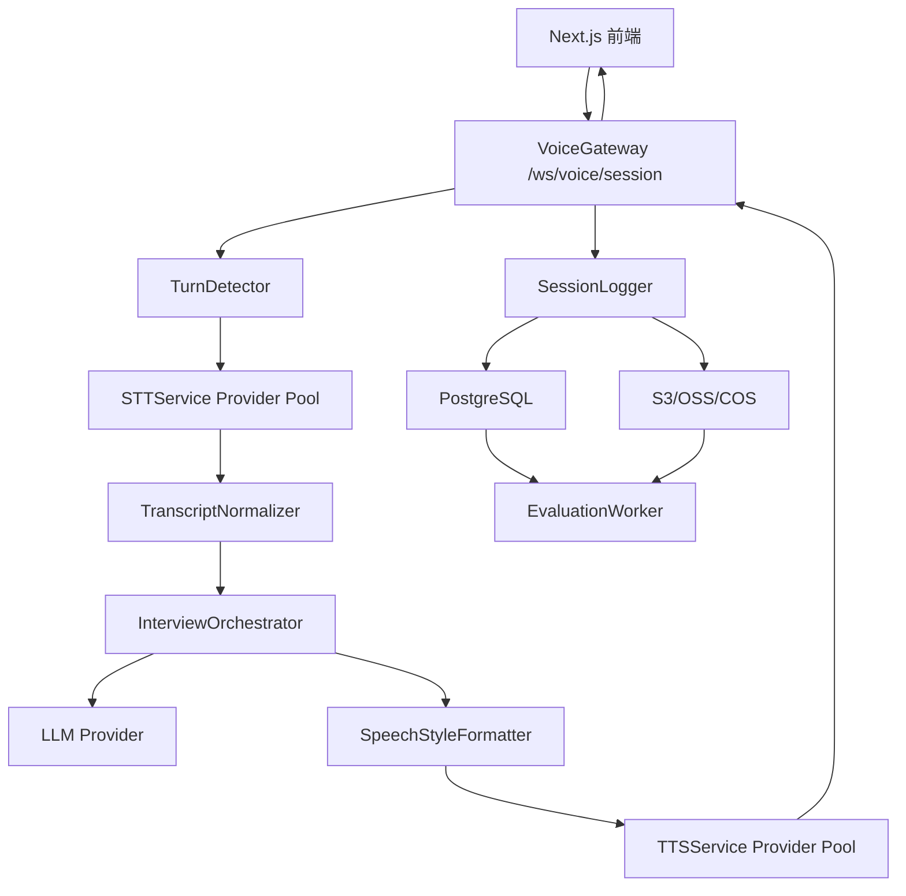
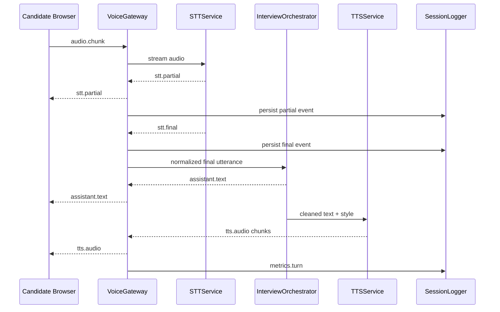
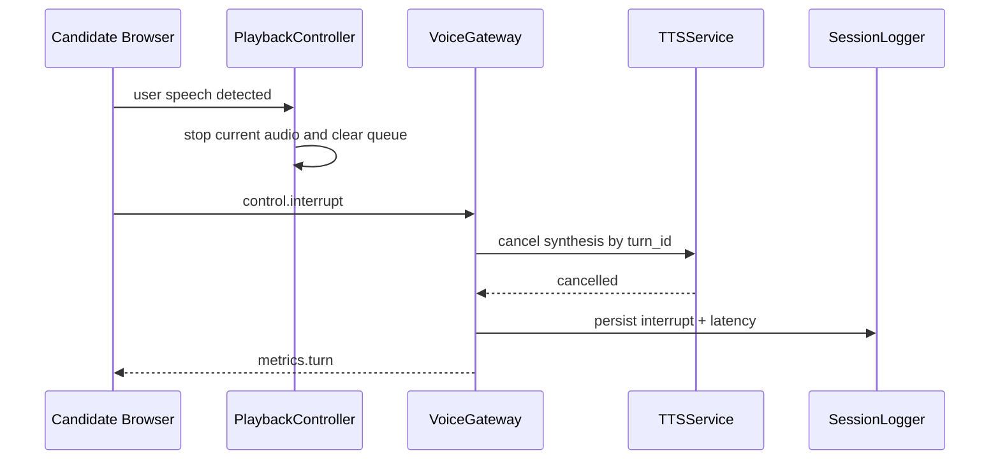
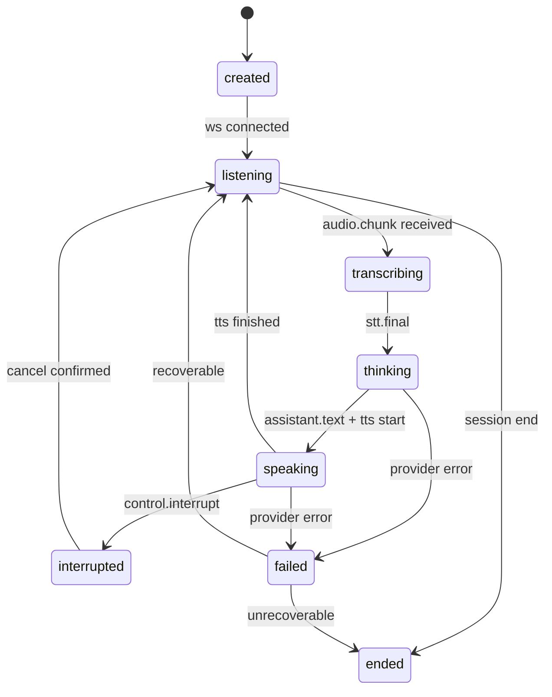

# 系统架构

## 总体架构

系统由前端语音客户端、后端 Voice Gateway、STT provider、LLM 编排、TTS provider、存储与离线评估组成。

## 模块职责

- `AudioCaptureClient`：申请麦克风权限、采样、音量检测、编码音频 chunk。
- `VoiceSocketClient`：维护 WebSocket、发送音频和控制事件、处理重连。
- `PlaybackController`：管理音频播放队列、顺序播放、停止和清空队列。
- `VoiceGateway`：会话鉴权、事件路由、心跳、取消、指标汇总。
- `TurnDetector`：结合 VAD、静音时间和语义结束信号判断 utterance 边界。
- `STTService`：统一 STT provider 接口，输出 partial/final。
- `TranscriptNormalizer`：修正标点、过滤口头填充词、规范中英混排和数字。
- `InterviewOrchestrator`：维护面试状态，调用 LLM 生成追问、澄清、下一题和评分辅助结果。
- `SpeechStyleFormatter`：把 LLM 原始文本改写为适合 TTS 的短句和 SSML。
- `TTSService`：统一 TTS provider 接口，支持流式合成和取消。
- `SessionLogger`：保存事件流、指标、错误、provider 信息。
- `EvaluationWorker`：离线复核 ASR 准确率、TTS 质量抽检和异常会话分析。

## 主流程

## 打断流程

## STT Provider 抽象

STT provider 必须实现统一接口：

- `start_session(session_id, config)`
- `send_audio(chunk)`
- `stream_events()`，输出 `stt.partial` 和 `stt.final`
- `close()`

MVP 默认 Azure Speech SDK。腾讯云、阿里云、FunASR 通过同样事件模型接入。业务层只消费 provider 输出，不关心厂商协议。

## TTS Provider 抽象

TTS provider 必须实现统一接口：

- `synthesize_stream(turn_id, text, style)`
- `cancel(turn_id)`

MVP 默认 Azure Neural TTS + SSML。OpenAI TTS、CosyVoice 作为后续 provider。业务层只处理 `tts.audio` 音频 chunk。

## 为什么 partial transcript 不进入 LLM

- partial 文本可能回滚，直接进入 LLM 会造成误理解。
- 中文断句需要上下文，partial 容易缺标点或错分句。
- 面试场景追问必须基于稳定回答，否则会显得抢话或误判。
- partial 仍可展示给候选人，帮助候选人确认系统正在听。

## 会话状态机

