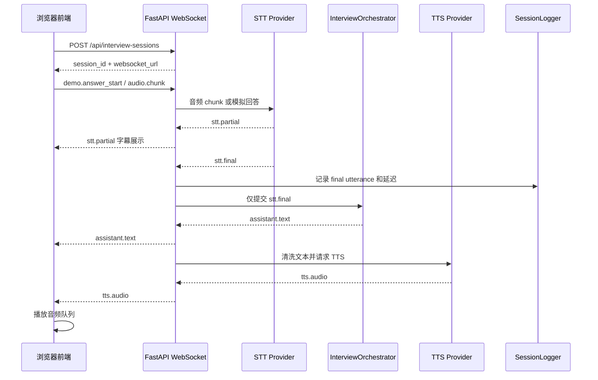
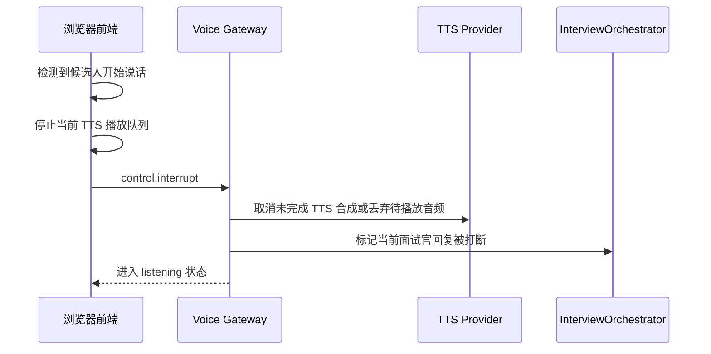

# 第一版 Demo 汇报材料

## 1. 项目目标

本项目第一版 Demo 的目标是验证 AI 面试官语音链路的可行性，形成一个研发团队可以继续开发的前后端骨架和完整技术说明。

核心场景：

1. 候选人通过浏览器麦克风回答问题。
2. 系统将候选人语音转成文字。
3. AI 面试官基于最终稳定文本理解回答，并生成追问或反馈。
4. 系统将面试官文本转成自然、专业、温和的语音。
5. 候选人打断时，系统停止当前播放并进入新的收听状态。

当前版本是可运行前端控制台加 FastAPI mock 后端。前端会优先连接后端 WebSocket；如果后端未启动，会自动降级到本地模拟链路。当前不声称已经接入 Azure、OpenAI、腾讯云或阿里云等外部 API。

## 2. 技术栈

第一版已使用和建议延展的技术栈：

| 层级 | 技术选择 | 当前状态 |
|---|---|---|
| 前端 | Vite + React + TypeScript | `app/frontend` 已可运行，第一屏是语音面试控制台 |
| 音频采集 | Web Audio API | 当前做麦克风授权检查与模拟回答；真实音频 chunk 接入位已明确 |
| 实时通信 | WebSocket | 前端已联动 `app/backend` mock WebSocket |
| 后端 | FastAPI + asyncio | `app/backend` 已提供 REST 和 WebSocket 服务 |
| STT | Azure Speech SDK / 腾讯云 / 阿里云 / mock | 当前为 mock，真实 provider 预留 |
| LLM 编排 | InterviewOrchestrator | 当前为 mock 追问逻辑，真实 LLM 接入位预留 |
| TTS | Azure Neural TTS / OpenAI TTS / mock | 当前为 mock `tts.audio` 事件，真实 provider 预留 |
| 日志指标 | event log + turn metrics | 前端展示事件日志和 turn 级延迟指标 |
| 存储 | PostgreSQL + S3/OSS/COS | 当前未接入，文档已定义方向 |

## 3. 语音链路如何打通

端到端链路如下：



关键规则：

- `audio.chunk` 是候选人语音输入。
- `stt.partial` 只用于实时字幕，不进入 LLM。
- `stt.final` 才进入面试官理解和追问逻辑。
- `assistant.text` 是面试官文本回复。
- `tts.audio` 是面试官语音输出。
- `metrics.turn` 记录每轮 STT、LLM、TTS 和端到端延迟。

## 4. 打断链路

面试场景必须支持候选人打断，否则语音体验会显得僵硬。



第一版验收目标：

- 前端能主动清空播放队列。
- 后端能接收 `control.interrupt`。
- 当前 turn 能记录被打断状态。
- 后续真实 TTS 接入时，需要支持取消合成或丢弃未发送音频。

## 5. STT/TTS Provider 策略

Provider 抽象是本项目的核心工程设计。业务编排不直接绑定某个云厂商，而是通过统一接口调用。

STT 策略：

- MVP 默认推荐 Azure Speech SDK，原因是中文实时识别、标点、企业稳定性和接入效率较均衡。
- 国内部署可替换腾讯云实时语音识别或阿里云智能语音交互。
- 私有化路线可评估 FunASR。
- 当前 Demo 使用 mock STT，只模拟事件流，不连接外部服务。

TTS 策略：

- MVP 默认推荐 Azure Neural TTS，原因是中文音色较自然，支持 SSML 控制语速、停顿、音高和风格。
- OpenAI TTS 可作为备选，适合统一 OpenAI 技术栈。
- 私有化和定制音色可后续评估 CosyVoice 或 Fish Speech，但需要先确认商用授权和声音授权。
- 当前 Demo 使用 mock TTS，只模拟 `tts.audio` 事件，不生成真实外部语音。

不推荐作为商业默认：

- Edge TTS：非正式商用 API 风险较高。
- ChatTTS：更适合研究和 demo，商用边界需要谨慎确认。
- Bark：实时性和稳定性不适合面试主链路。

## 6. 需要的 API 服务

真实 MVP 需要准备：

| 服务 | 用途 | 备注 |
|---|---|---|
| STT API | 候选人语音转文字 | Azure、腾讯云、阿里云三选一或多 provider |
| TTS API | 面试官文本转语音 | Azure Neural TTS 或 OpenAI TTS |
| LLM API | 回答理解、追问、评分辅助 | 需独立 prompt、上下文和评分策略 |
| 数据库 | 保存 session、turn、事件、指标 | 推荐 PostgreSQL |
| 对象存储 | 保存授权后的音频片段 | S3、OSS、COS 或内部对象存储 |
| 日志指标 | 观测延迟、错误和打断成功率 | OpenTelemetry、Prometheus/Grafana 或 ELK |

环境变量示例：

```bash
APP_ENV=development
DEFAULT_STT_PROVIDER=mock
DEFAULT_TTS_PROVIDER=mock
AZURE_SPEECH_KEY=
AZURE_SPEECH_REGION=
AZURE_TTS_VOICE=zh-CN-XiaoxiaoNeural
OPENAI_API_KEY=
DATABASE_URL=
AUDIO_BUCKET_NAME=
```

真实密钥不得提交到仓库。

## 7. 当前 Demo 边界

已具备：

- 完整文档体系。
- REST session endpoint 骨架。
- WebSocket voice session endpoint 骨架。
- 前端录音、播放、WebSocket、事件类型模块。
- STT/TTS provider 抽象。
- Azure provider 占位文件。
- mock provider 文件。
- 面试编排、文本归一化、turn detector、session logger 边界。

尚未完成：

- 真实 UI 页面完整打磨。
- 真实 STT API 接入。
- 真实 TTS API 接入。
- 真实 LLM API 接入。
- 音频对象存储。
- 数据库持久化。
- 生产鉴权、审计和权限控制。
- 自动化端到端测试。

## 8. 使用注意事项

- 演示时需要明确说明当前是 mock 链路，用来展示产品流程和工程边界。
- 不要把 `stt.partial` 用于追问生成，否则会引入误识别、文本回滚和错误追问。
- TTS 文本必须先经过清洗，避免朗读 Markdown、代码块、复杂列表和不可读符号。
- 面试官语音应保持专业、温和、清晰，不做过度拟人化或情绪化表达。
- 候选人录音前必须有授权告知，真实上线前需要补齐数据保存和删除策略。
- 云厂商接入前需要确认数据处理协议、地域、日志保留和合规要求。
- 面试评分需要避免把语音识别错误直接当作候选人能力缺陷。

## 9. 风险与应对

| 风险 | 影响 | 应对 |
|---|---|---|
| STT 误识别 | AI 追问跑偏，评分不准确 | 使用 final utterance、热词、离线复核和人工抽检 |
| TTS 太机械 | 面试体验差 | 使用 Azure Neural TTS + SSML 控制语速、停顿和语气 |
| 打断不及时 | 用户觉得系统不自然 | 前端立即停播，后端取消或丢弃待播放音频 |
| 云服务延迟 | 对话等待时间过长 | 句子级 TTS、首包播放、provider 监控和降级 |
| 数据隐私 | 合规和信任风险 | 授权告知、最小化存储、加密、审计和删除机制 |
| 商用授权不清 | 上线风险 | 默认使用正式 API，开源模型上线前做 license 审查 |

## 10. 后续迭代路线

第一阶段：可演示前端

- 补齐前端页面。
- 展示录音状态、候选人字幕、面试官文本和播放状态。
- 接通后端 mock WebSocket。

第二阶段：真实 STT/TTS 接入

- 接入 Azure Speech SDK 或国内云 STT。
- 接入 Azure Neural TTS 或 OpenAI TTS。
- 打通真实音频输入和语音输出。

第三阶段：LLM 面试编排

- 接入 LLM provider。
- 使用系统 prompt、追问 prompt 和评分辅助 prompt。
- 加入岗位题库、评分维度和上下文裁剪。

第四阶段：观测、评估和合规

- 落库 session、turn、事件和指标。
- 保存授权音频并支持删除。
- 建立延迟、错误率、打断成功率 dashboard。
- 做 STT 准确率抽样评估和 TTS 体验人评。

## 11. 汇报结论

第一版 Demo 已完成从产品需求、技术架构、接口协议到前后端骨架的基础建设。当前版本没有真实外部 API 接入，但已经把 STT、LLM、TTS、WebSocket、打断和日志指标的关键工程边界拆清楚。

下一步建议优先完成一个可展示 UI 页面，并用 mock provider 打通浏览器到后端的完整事件流。随后再接入一个真实 STT 和一个真实 TTS provider，验证真实语音延迟、准确率和面试体验。
